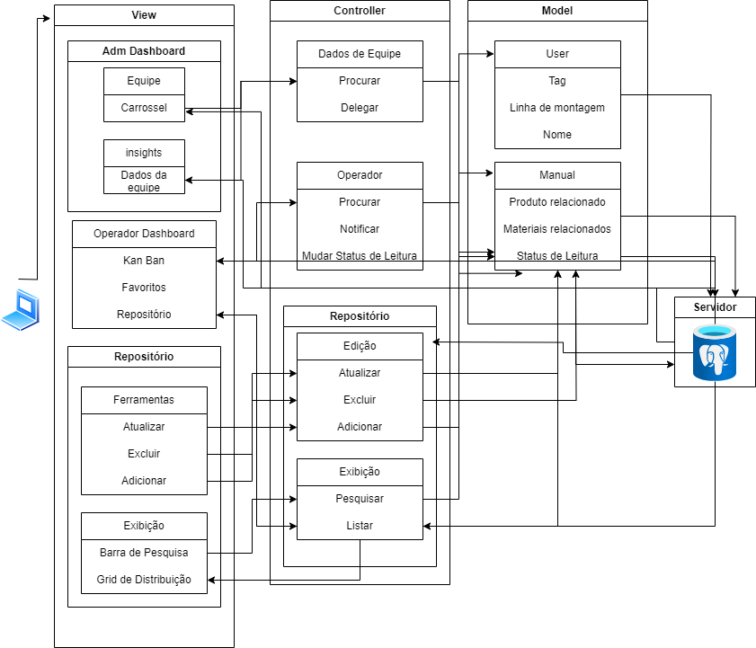

# MVC - LedTech/Dell
- <b> Nome do Projeto: </b> DellAware
- <b> Descrição: </b> Trata-se de uma aplicação web desenvolvida para a Dell Technologies, voltada a facilitar a transferência de informação entre a equipe de engenheiros e os montadores da linha de produção. Para tanto, disponibilizar-se-á, por meio da ação dos administradores, os manuais necessários para a linha de produção individualmente a cada montador da fábrica. Além disso, os montadores terão a chance de checar os manuais que já leram e os administradores verão o desempenho dos montadores em relação a leitura dos manuais.
- <b> Arquitetura: </b> MVC (Model-View-Controller)
- <b> Ferramenta de Diagramação: </b> draw.io

## Modelos (Models):

&nbsp;&nbsp;&nbsp;&nbsp; O modelo deste projeto é composto de três entidades principais: administradores, montadores e manuais. O primeiro é composto pelos seguintes atributos: tag de administrador, seu nome e as linhas em que opera. Já o segundo é composto pelos seguintes atributos: tag de montador, seu nome e a linha em que opera. Enquanto isso, o último é composto pelos seguintes atributos: produto que faz jus, materias associados e seu status de leitura para cada montador.  
&nbsp;&nbsp;&nbsp;&nbsp; Entre si, esses atributos estabelecem o relacionamento de "leitura", segundo o seguinte modelo conceitual:

Figura 2 - Modelo conceitual  
  

Material produzido pelos autores (2024)

## Controladores (Controllers):

&nbsp;&nbsp;&nbsp;&nbsp; Nesta aplicação, os usuários serão divididos em administradores e montadores. Os administradores têm acesso aos seguintes controladores:
- Adicionar_manual: adiciona um manual à lista de manuais
  - Parâmetros de entrada: Produto relacionado, nome do manual e materiais relacionados
  - Parâmetros de saída: N/A
  - Ações: Pedir ao model para adicionar um registro a tabela "manuais"
  - View: altera o repositório de manuais, adicionando um manual

- Atualizar_manual: atualiza um manual já criado
  - Parâmetros de entrada: alterações a serem feitas
  - Parâmetros de saída: N/A
  - Ações: Pedir ao model para alterar um registro da tabela "manuais"
  - View: altera o repositório de manuais, atualizando-o; adiciona uma descrição da atualização aos funcionários que tinham o manual na sua lista de leitura e altera o dashboard do funcionário atualizando a leitura
  
- Delegar: delega uma leitura a um montador
  - Parâmetros de entrada: nome e linha de montagem
  - Parâmetros de saída: N/A
  - Ações: Pedir ao model para adicionar um registro a tabela "leitura"
  - View: altera o dashboard do montador, adicionando a leitura; altera a dashboard do administrador com novas informações

- Dados da Equipe - Pesquisar : possibilita a visualização dos dados de um funcionário
  - Parâmetros de entrada: nome do montador e linha de montagem
  - Parâmetros de saída: manuais delegados ao operador e dados relacionados à leitura
  - Ações: Pedir ao model para consultar os dados de leitura de um montador
  - View: Abre uma aba com os dados do funcionário 
 
&nbsp;&nbsp;&nbsp;&nbsp; Já os montadores têm acesso aos seguintes controllers:
- Operador: Procurar : possibilita a visualização dos manuais delegados ao operador
  - Parâmetros de entrada: nome do montador e linha de montagem
  - Parâmetros de saída: manuais delegados ao operador
  - Ações: Pedir ao model para consultar os dados de leitura de um montador
  - View: adiciona o manual ao kanban

## Views (Views):

&nbsp;&nbsp;&nbsp;&nbsp; As views, ou seja, as interfaces as quais os usuários irão interagir são:
- Dashboard do administrador: permitirá o administrador delegar manuais da lista de leitura de seus funcionários e ver o desempenho deles;
- Dashboard do montador: permitirá o montador ver sua lista de leitura, checar as leituras já feitas e acessar os manuais;
- Repositório de manuais: permitirá ao administrador adicionar e atualizar manuais

## Infraestrutura:

&nbsp;&nbsp;&nbsp;&nbsp; Neste projeto, utilizamos o PostgreSQL como banco de dados, o Sails.js como framework e o HTML5 e CSS3 para a construção da UI. Essas tecnologias se relacionam à arquitetura MVC da seguinte forma:
- HTML5 e CSS3: View
- Sails.js: Controller/model
- PostgreSQL: Server

&nbsp;&nbsp;&nbsp;&nbsp; Isso foi feito levando em consideração as tecnologias disponibilizadas pela instituição e a trilha de aprendizagem do módulo. Preferiu-se, também, o uso de tecnologias "open source", como o Sails.js. Com relação ao impacto no projeto, a integração das tecnologias escolhidas à arquitetura MVC proporciona uma estrutura robusta para o projeto. O uso do framework Sails.js agiliza o desenvolvimento ao oferecer funcionalidades predefinidas para lidar com a lógica de negócios e interação com o banco de dados. Além disso, a adoção de tecnologias de código aberto reduz os custos e aumenta a flexibilidade do projeto, permitindo adaptações conforme necessário. Essas decisões combinadas promovem uma implementação eficiente e adaptável, alinhada às exigências do projeto e as habilidades da equipe.

## Implicações da Arquitetura:

&nbsp;&nbsp;&nbsp;&nbsp; A arquitetura Model-View-Controller (MVC) traz implicações importantes para o projeto "DellAware" da LedTech/Dell em termos de escalabilidade, manutenção, testabilidade e colaboração entre equipes de desenvolvimento. Com a separação clara de responsabilidades entre Model, View e Controller, o projeto se torna mais escalável. É possível escalar diferentes partes do sistema independentemente umas das outras, respondendo de forma eficiente a mudanças na demanda ou no volume de dados. De forma semelhante, em relação à manutenção, a divisão em três componentes distintos simplifica as atualizações e correções de bugs. As alterações podem ser feitas em cada componente de forma independente, sem afetar diretamente as outras partes do sistema. Isso torna o processo de desenvolvimento mais ágil e menos propenso a introduzir novos problemas.  
&nbsp;&nbsp;&nbsp;&nbsp; A testabilidade também é beneficiada pela arquitetura MVC. Cada componente pode ser testado de forma isolada, garantindo que eles estejam funcionando corretamente e interagindo entre si da maneira esperada. Isso facilita a detecção e correção de erros durante o processo de desenvolvimento, garantindo a qualidade do software final. Além disso, a adoção do padrão MVC facilita a colaboração entre equipes de desenvolvimento. Com responsabilidades claramente definidas para cada componente, as equipes podem trabalhar de forma mais eficiente e coordenada, focando em suas áreas de especialização e contribuindo para o projeto de maneira mais eficaz.  
&nbsp;&nbsp;&nbsp;&nbsp; Em resumo, a arquitetura MVC proporciona uma estrutura sólida para o desenvolvimento do projeto "DellAware", oferecendo benefícios significativos em termos de escalabilidade, manutenção, testabilidade e colaboração entre equipes de desenvolvimento. Isso contribui para a criação de um software robusto, flexível e de alta qualidade.
